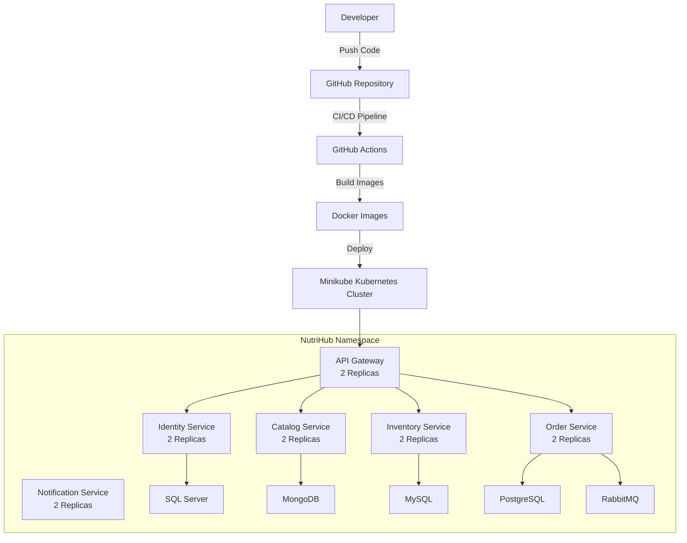

🥗 NutriHub — Microservices Platform
-------------------------------------
NutriHub is a cloud-native food delivery and nutrition management platform built with a microservices architecture. It demonstrates real-world patterns including asynchronous messaging, containerisation, orchestration, and CI/CD automation.


## 🏗️ Architectural Overview

 ```mermaid
flowchart TB

    Gateway["API Gateway<br/>.NET / YARP<br/>Port: 5000"]

    Identity["Identity Service<br/>Port: 5001"]
    Catalog["Catalog Service<br/>Port: 5002"]
    Order["Order Service<br/>Port: 5003"]
    Inventory["Inventory Service<br/>Port: 5004"]
    Notification["Notification Service<br/>Port: 5005"]

    Gateway -->|JWT| Identity
    Gateway -->|JWT| Catalog
    Gateway -->|JWT| Order
    Gateway -->|JWT| Inventory

    Catalog -->|gRPC| Inventory
    Order -->|RabbitMQ| Inventory
    Order -->|RabbitMQ| Notification

    Note["JWT is validated at the API Gateway and again by every service (Zero Trust Architecture)."]

    Gateway -.-> Note
```

## ☸️ Deployment Architecture




🧩 Microservices
----------------

🌐 API Gateway — Port 5000
--------------------------
Tech: .NET · YARP (Yet Another Reverse Proxy)

Role: Request routing, JWT validation

🔐 Identity Service — Port 5001
-------------------------------
Tech: .NET · SQL Server

Role: User registration, login, JWT issuance,Refresh token

📦 Catalog Service — Port 5002
------------------------------
Tech: .NET · MongoDB

Role: Category and product management

🛒 Order Service — Port 5003
----------------------------
Tech: Java · PostgreSQL

Role: Order lifecycle management

📊 Inventory Service — Port 5004
--------------------------------
Tech: Java · MySQL

Role: Stock levels and stock updates

🔔 Notification Service — Port 5005
-----------------------------------
Tech: .NET

Role: Notifications triggered via RabbitMQ


🔗 Service Communication
------------------------

- Catalog → Inventory
  
Real-time stock data fetched via gRPC — low latency, strongly typed, efficient for internal calls.

- Order → Inventory & Notification
  
Order events published to RabbitMQ — fully asynchronous and decoupled. If Notification Service restarts, messages wait safely in the queue.


🔐 Security — Zero Trust Architecture
-------------------------------------

JWT tokens are validated at two levels:

- API Gateway — rejects unauthenticated requests before they reach any service
- Every individual service — independently validates the token; no service blindly trusts a request just because it came from the gateway

 "Never trust, always verify" — even internal service calls require valid JWT.


⚙️ Tech Stack
-------------
 - API Gateway — YARP Reverse Proxy (.NET)
 - Authentication — JWT (Zero Trust — validated at every level)
 - Async Messaging — RabbitMQ
 - Sync Internal Communication — gRPC (Catalog ↔ Inventory)
 - Databases — SQL Server · MongoDB · PostgreSQL · MySQL
 - Containerisation — Docker · Docker Hub
 - Orchestration — Kubernetes (Deployments, Services, ConfigMaps, Secrets)
 - CI/CD — GitHub Actions (matrix strategy — 6 parallel build jobs)

### Deployment Summary

- Kubernetes: Minikube
- Namespace: nutrihub
- API Gateway: 2 Replicas
- Identity Service: 2 Replicas
- Catalog Service: 2 Replicas
- Order Service: 2 Replicas
- Inventory Service: 2 Replicas
- Notification Service: 2 Replicas
- RabbitMQ for asynchronous messaging
- MongoDB for Catalog Service
- SQL Server for Identity Service
- PostgreSQL for Order Service
- MySQL for Inventory Service

🐳 Running with Docker
----------------------

# Clone the repository

git clone https://github.com/SelmaBasheer/nutrihub.git

cd nutrihub

# Start all services

docker-compose up -d

# Check running containers

docker ps

All images are published to Docker Hub.


☸️ Running on Kubernetes
------------------------
# Start Minikube

minikube start --memory=4096 --cpus=4

# Apply all manifests
kubectl apply -f k8s/

# Check pods
kubectl get pods -n nutrihub

# Access API Gateway
minikube service api-gateway -n nutrihub


🚀 CI/CD Pipeline
-----------------

GitHub Actions triggers on every push to main:

Push to main
    │
    ├── Build & Push (6 jobs — parallel matrix strategy)
    │       └── docker build → docker push to Docker Hub
    │
    └── Deploy
            └── kubectl apply -f k8s/
